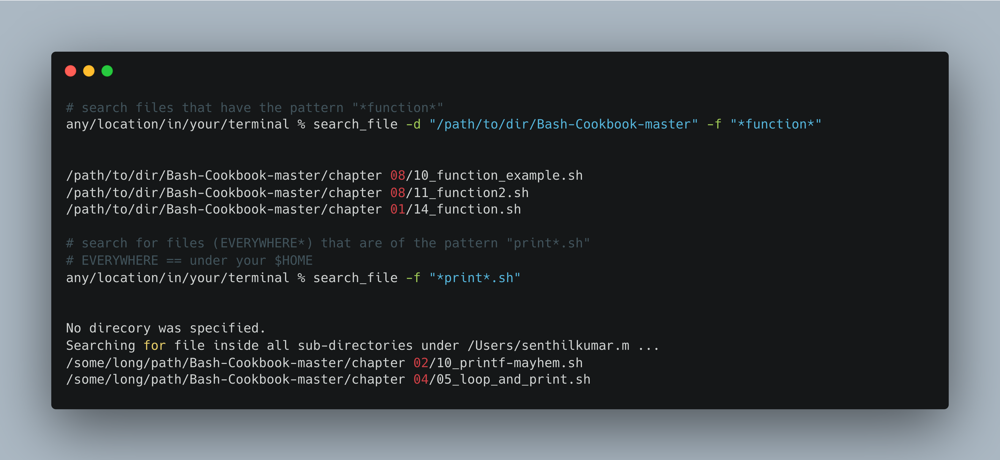
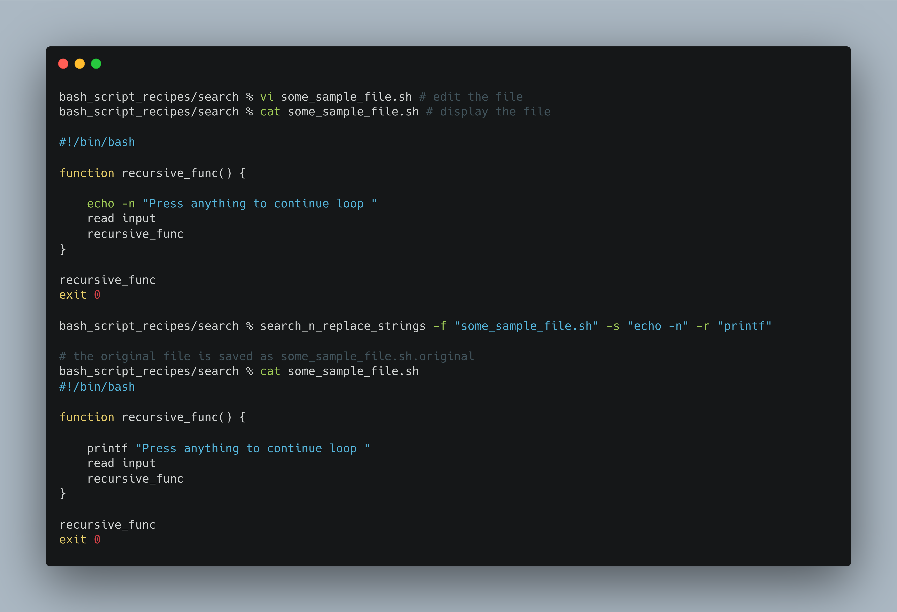
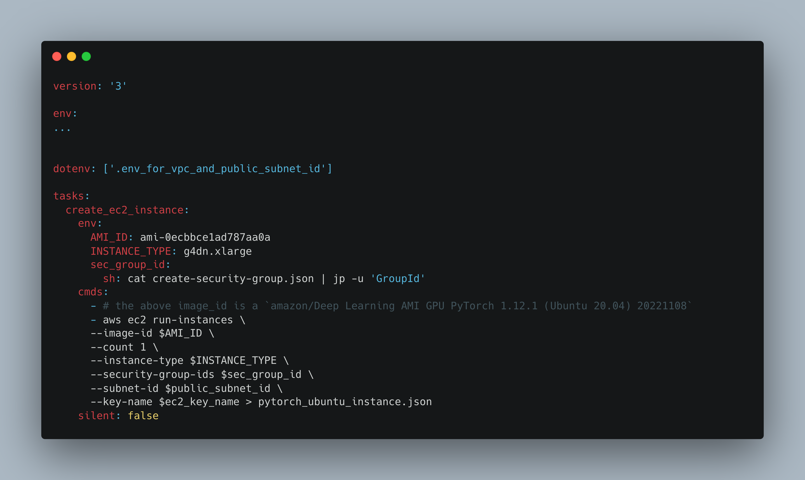

Bash Scripting can improve the productivity of a gamut of professionals not just DevOps, SysAdmin, Networking, ML or Cloud Engineers. It can aid product owners, scrum masters, HR professionals and even time-crunched CXOs to do their repetitive tasks faster. 


Table of Contents
- I. Introduction
- II. Bash Script Recipes (main topic)
- III. NL2Bash using LLMs
- IV. Concluding Remarks
## I.Introduction

### I.A. Why Bash Scripting

Everyone of us deals with files and directories. We search/move/delete/copy files. We look for a particular file or directory. We may even want to search a word/phrase in the files. With Bash, we can do those tasks at scale and at great speed. 

### I.B.  Why Bash Script Recipes
- Create your own simplified bash recipes for tasks that you do repetitively. The recipes could string together several bash commands underneath, but you have abstracted them for quick use

### I.C.  What is in it for you 
The bash script recipes discussed here are intended for 2 purposes. The reader can
1. directly use the recipes in their day-to-day work (like a mini cookbook), or 
2. use the recipes to learn the fundamentals and create their own recipes 

### I.D. Prerequisites
- Understanding of what is Bash and what is a linux kernel, which the Bash interacts with. Refer [here](https://homepages.uc.edu/~thomam/Intro_Unix_Text/OS_Organization.html) if interested


- Not mandatory, but other helpful pre-reading material: 
	- Google's Shell Scripting Style guide: [When to use a Shell Script](https://google.github.io/styleguide/shellguide.html#when-to-use-shell) | [how to write function and comments](https://google.github.io/styleguide/shellguide.html#function-comments)
	- [Which Shell to use](https://www.hexnode.com/blogs/the-ultimate-guide-to-mac-shell-scripting/#:~:text=Mac's%20default%20shell%20is%20either,the%20default%20shell%20is%20zsh.)
	

---

## II.  The Bash CLI Recipes

Generic Recipes for everyone
1. `search_file` & `search_file_with_regex`
2. `search_string_with_regex`  & `search_n_replace_with_string`
3. `manage_files`
4. `inside_csv`
5. AWS Recipes 

Each of the recipe has the following details:
- Core Function(s)
- Learnings
- How to run it as a bash command

You can always use your own data to run the recipes. 
If you would like to replicate what I have, follow below instructions. 
For sections II.1 and II.2, we are using using [this github repo](https://github.com/PacktPublishing/Bash-Cookbook/tree/master)  as dataset to play with
- Download the data as follows

```bash
# in any new directory of yours
mkdir -p dir_to_run_bash_scripts && cd dir_to_run_bash_scripts
curl -L https://github.com/PacktPublishing/Bash-Cookbook/archive/refs/heads/master.zip -O && mv master.zip Bash-Coolbook.zip
unzip Bash-Coolbook.zip
```

For section II.4, use [this csv file](https://github.com/altair-viz/vega_datasets/blob/master/vega_datasets/_data/la-riots.csv):

```bash
curl https://github.com/altair-viz/vega_datasets/blob/master/vega_datasets/_data/la-riots.csv >> la-riots.csv
```
### II. 1.  Searching Files

`search_file`




**Core Function** in the bash script `search_file.bash`

```bash
function search_file_in_a_dir()
{
	find "$1" -type f -name "$2"
}
```

**Learnings**:

- `find` allows to search for a file recursively under every dir in a specific dir 
- Parameters such as  are passed to functions as positional arguments


**How to run the bash script as a command**: 

```bash
% search_file -d ./dir_to_search -f "*partial_file_to_search*"
% search_file -f "some_partial_file_name*" # OR search_file -f "full_file_name"
```


For **full recipe details** and bash outputs, refer [here](https://github.com/senthilkumarm1901/bash_script_recipes/tree/main/search#1-search-file)

---

`search_file_with_regex`


**Core Functions** in the bash script `search_file_with_regex.bash`

```bash
function 1_search_file_in_a_dir()
{
	find "$1" -type f
}

function 2_to_treat_space_in_file_path()
{
	sed "s| |?|g"
}

function 3_isolate_file_name()
{
	rev | cut -d'/' -f1 | rev
}

function 4_run_regex_file_search()
{
	grep -E "$2"
}

function main_function()
{
	1_search_file_in_a_dir $1 | 2_to_treat_space_in_file_path | 3_isolate_the_file_name | 4_run_regex_file_search $2
}

# in one line, the above command is 
# find "$1" -type f |  sed "s| |?|g" | rev | cut -d'/' -f1 | rev | grep -E "$2"
```

**Learnings**:

- Note the piping ( | ) in the main function `search_regex_file_in_a_dir` 
- There may be space in a file path. E.g.: "/path/to/an amazing dir/a file name.csv"
- `sed` (streaming editor) is introduced here to `find_and_replace` `a space` as we we are parsing the output of `find` which could have space
- `3_isolate_file_name` function isolates the filename in the end by the dir separator "/" 
- `grep -E` allows for execution of regex filtering on the previous output we have piped
- In a regex search, [ . * ( ) ] + are metacharacters. If you need to match them as is, escape with a backslash. E.g.: "[0-9]+_[a-z]+\.sh" will match a file_name like "02_some_file_name.sh"
- While you can use "*" in `search_file` but not here `search_file_with_regex`

**How to run the bash script as a command**: 

```bash
# if you know the source directory where to search
% search_file_with_regex -d ./dir_to_search -rf "[0-9]+_[a-z]+\.sh"
# if you do not know the directory where to search, we will search from $HOME
% search_file_with_regex -rf "some_regex_pattern" 
```

For **full recipe details** and bash outputs, refer [here](https://github.com/senthilkumarm1901/bash_script_recipes/tree/main/search#2-search-file-with-regex-pattern)

---

### II. 2. Searching Strings

`search_string`


**Core Function**

```bash
function search_a_string()
{
    find "$1" -type f -name "$2" -exec grep -H -n -E "$3" -o {} \;
}
```

**Learnings**:

- Do note the use of `-exec` which will direct grep to search inside every matching file from `find`
- `grep -n` gives out number of line that matches
- `grep -o` outputs the matched string
- `grep -E` allows "Extended" Regex patterns as input 


**How to run the bash script as a command**: 

```bash
# do note, it need not be just regex_pattern search, even a normal word as is will also be fetched
% search_string -d dir_name -f file_name -s regex_search_string
# if you do not know directory or type of file, you can simply do the below search string itself
% search_string -s regex_search_string
# example
# search_string -d "/some/dir" -f "*.sh" -s "[a-z_]+\(\)"
```

For **full recipe details** and bash outputs, refer [here](https://github.com/senthilkumarm1901/bash_script_recipes/tree/main/search#3-search-a-string)

<hr>

``
`search_n_replace_strings`




**Core Function**:

```bash
function search_n_replace_the_string()
{
	search_string="$1"
	replacement_string="$2"
	full_file_path="$3"
    echo "$search_string" 
    echo "$replacement_string"
	sed -i'.original' -e "s|$search_string|$replacement_string|g" $full_file_path
}
```

**Learnings**:

- `sed -i ''` command replaces the file in-place and leaves no backup. 
- If you want a backup, you could give something like this `sed -i '.backup'` to retrieve the original file later


**How to run the bash script as a command**: (refer here)

```bash
# if you do not know directory, you can specify the other 3 parameters
% search_n_replace_strings -f filename -s search_string -r replacement_string
```

For **full recipe details** and bash outputs, refer [here](https://github.com/senthilkumarm1901/bash_script_recipes/tree/main/search#4-search-and-replace-string)

---

### II.3. Manage files

`manage_files`

Core Functions

```bash
# functions below are run as 
# func_name arg1 arg2 ...

function count_files_inside_dir() 
{
       directory="$1"
       num_files=$(ls -l "$directory" | grep -v "^d" | wc -l)
       echo "Number of files in $directory: $num_files"
}

function backup_file() 
{
   file="$1"
   timestamp=$(date +"%Y%m%d%H%M%S")
   cp "$file" "$file.$timestamp"
   echo "Backup created: $file.$timestamp"
}

function get_size() 
{
   file_or_dir="$1"
   if [ -f "$file_or_dir" ]; then
	   size=$(du -sh "$file_or_dir" | awk '{print $1}')
	   echo "Size of $file: $size"
   elif [ -d "$file_or_dir" ]; then
	   size=$(du -sh "$file_or_dir" | awk '{print $1}')
	   echo "Size of directory $file: $size"
   else
	   echo "$file not found or is not a regular file or directory."
   fi
}

function split_file_into_n_chunks()
{
	num_of_chunks=$1
	file_to_split=$2
	output_prefix=$3
	split -n $num_of_chunks $file_to_split $output_prefix
}

# the below functions are hardcoded for better understandability
function split_file_based_on_size()
{
	any_file=sample_file.zip
	max_split_file_size=50M #100K 50M 2G refer to KB, MB and GB
	split -b $max_split_file_size $any_file "part_"
}

function join_files()
{
	files_prefix="part_*"
	cat $files_prefix  > sample_file_regrouped.zip
}
```

**Learnings**:

- The commands we have covered here include 
	- a combination of list dir command `ls`, `grep "^d"` (anything but a directory) and word count by line `wc -l`
	- backup based on time using `date` and `cp`
	- conditions like `[ -d $file_or_dir]`  to detect if the value is a directory
	- `split` and `cat`


**How to run the bash script as a command**:

```bash
# inside the recipe, there will be a if clause to direct to the right function
# refer full recipe for details
% manage_files --function_name arg1 arg2
# You can also add any number of other file operations that you want to club with `manage_files`
```

For **full recipe details**, refer [here](https://github.com/senthilkumarm1901/bash_script_recipes/blob/main/manage_files/manage_files.bash)

---
### II.4. Inside CSV


`inside_csv`

```bash
# `display_column_names`, `display_n_rows_in_a_column` `basic_conditional_operations`

function display_column_names()
{
	file_name=$1
	head -n 1 $file_name | sed 's|,|\n|g'
}

function display_n_rows_in_a_column()
{
	file_name=$1
	column_name=$2
	num_rows=$3
	specific_column_number=$(head -n 1 $file_name | sed 's|,|\n|g' | nl | grep "$column_name" | grep -E "[0-9]+" -o)
	awk -F',' -v column_number=$specific_column_number '{print $column_number}' $file_name | head -n num_rows
}

# the below functions are hard-coded for better understandability
# can you count the number of rows where gender=="Male"
function filter_a_text_column()
{
	file_name="la-riots.csv"
	column_name="gender"
    text_to_filter="Male"
	specific_column_number=$(head -n 1 $file_name | sed 's|,|\n|g' | nl | grep "$column_name" | grep -E "[0-9]+" -o)
	num_of_males=$(awk -F',' -v column_number=$specific_column_number '$column_number=="$text_to_filter" { print }' $file_name | wc -l)
	echo "Number of males: $num_of_males"
}

function filter_a_numeric_column()
{
	file_name="la-riots.csv"
	column_name="age"
    numeric_column_condition=">= 18"
	specific_column_number=$(head -n 1 $file_name | sed 's|,|\n|g' | nl | grep "$column_name" | grep -E "[0-9]+" -o)
	age_gt_18=$(awk -F',' -v column_number=$specific_column_number '$column_number $numeric_column_condition { print }' $file_name | wc -l)
	echo "Num of ppl greater than or equal to 18: $age_gt_18"
}

```


**Learnings**:

- We have used primarily `awk` to parse inside files
- `awk` uses column_number as input. We infer column_number from column_name using `sed`, `nl` and `grep`


**How to run the bash script as a command**: 

```bash
# inside the recipe, there will be a if clause to direct to the right function
# refer full recipe for details
% inside_csv --function_name arg1 arg2
# You can also add any number of other file operations that you want to club with `manage_files`
```

For **full recipe details**, refer [here](https://github.com/senthilkumarm1901/bash_script_recipes/blob/main/inside_csv/inside_csv.bash)


----

### II.5. AWS Recipes

Thanks for hanging on, so far. Now let us try some  AWS specific recipes. 


**Manage Multiple AWS Accounts**

```bash
function recieve_and_verify_clipboard_contents
{
    pbpaste > ~/.aws/credentials
    verify=$(cat ~/.aws/credentials | head -n 2 | tail -n 1 | grep "aws_access_key_id")
    if [[ -z $verify ]] ; then
        echo "Your content below in Clipboard are not valid. \
            Please copy the correct short term credentials"
        echo $clipboard_content
    fi
}

function create_aws_environment_variables()
{
    export REGION=$1
    # typically AWS_PROFILE is a combination like below
    # <AWS_ACCOUNT_ID>_<IAM_ROLE> 
    export AWS_PROFILE=$(cat ~/.aws/credentials | head -n 1 | cut -c 2- | rev | cut -c 2- | rev)
    echo "AWS PROFILE: $AWS_PROFILE" 
    export AWS_ACCOUNT_ID=$(echo $AWS_PROFILE | awk -F'_' '{print $1}')
    aws configure set region $REGION --profile $AWS_PROFILE
    echo -n "Logging into the AWS ACCOUNT:"
    echo $AWS_ACCOUNT_ID
}
```

- The methodology to make `manage_multiple_aws_accounts` work anywhere in terminal is slightly different than the rest of the functions
- This because every time a shell script is run, it makes a copy of current shell and kills that shell once the shell script is executed.
- But we want the environment variables - $AWS_PROFILE, $REGION, $AWS_ACCOUNT_ID  to persist in our current shell window
- Hence add the below bash function to `~/.zshrc`. 

```bash
manage_multiple_aws_accounts()
{
    source /path/to/bash_script_recipes/aws_recipes/manage_multiple_aws_accounts.bash
    recieve_and_verify_clipboard_contents 
    if [[ $# -gt 0 ]]; then
        case "$1" in
            --region)
                region_name=$2       
                ;;         
            *)
                echo "Unknown option: $1"
                exit 1
                ;;
        esac
    fi
    create_aws_environment_variables $region_name
    echo -n "You have chosen Region:"
    echo $region_name
}
```

- This function `manage_multiple_aws_accounts` is sourced in every new terminal. It executes the commands in `create_aws_environment_variables` in every terminal and hence persisting the environment variables like `REGION`, `AWS_PROFILE`, `AWS_ACCOUNT_ID`  in your current terminal
- Note the `source` command which sources the `manage_multiple_aws_accounts.bash` script


### Run the script (this is as usual)

```bash
# keep the AWS Credentials copied 
# from your aws_sso_start url like https://my-sso-portal.awsapps.com/start
any/location/in/your/terminal % manage_multiple_aws_accounts --region ap-south-1

Copied Credentials successfully
AWS PROFILE: 123456789_DevOps-Engineer
Logging into the AWS ACCOUNT: 123456789
You have chosen Region: ap-south-1
```
- If you are a DevOps personnel, you may be interested in a fully AWS CLI solution | refer [link](https://medium.com/@pushkarjoshi0410/how-to-set-up-aws-cli-with-aws-single-sign-on-sso-acf4dd88e056) 

For **full recipe details**, refer [here](https://github.com/senthilkumarm1901/bash_script_recipes/tree/main/aws_recipes)


There are two sample AWS recipes created from scratch using AWS CLI and some basic bash commands. Do check it out at your leisure. 

1. `how to create and connect to an EC2 instance`  | [link](https://github.com/senthilkumarm1901/bash_script_recipes/blob/main/aws_recipes/create_and_connect_to_ec2_instance/Taskfile.yml) 
	- This is a Taskfile.yml. But in essence, you are executing individual bash commands
	- Taskfile is so intuitively good. Check it out [here](https://taskfile.dev/usage/). 



2. From scratch, how to `create_a_vpc_with_private_subnet_and_nat.bash` | [link](https://github.com/senthilkumarm1901/bash_script_recipes/blob/main/aws_recipes/create_vpc_sg_privatesub_NAT.bash)

---

## III. Natural Language 2 Bash (NL2Bash) using LLMs ...


NL2Bash can be done both via Paid and Free LLMs. 
1. If you are not constrained by budget, a paid Large Language Model based option is possible for productional use. Do explore  [AI-Shell](https://github.com/BuilderIO/ai-shell) and [Yolo](https://github.com/wunderwuzzi23/yolo-ai-cmdbot/tree/main) , powered by ChatGPT. 
2. If you want a fully local and free version, there is the repo [Ollama](https://github.com/jmorganca/ollama) for Mac OS, which simplifies running llama2 locally. 

If there is a solid case for giving users/developers a Natural Language way of accessing the application, the NL2Bash is a really good option.  
In fact, in the same API, NL2Py or NL2SQL can also be implemented to interact with your application.

NL2bash is truly exciting. However, if you won't be running an extensively varied list of bash commands, then using an NL option is akin to using a bulldozer to mow a lawn. You'd be better off mowing the old-fashioned way with custom Bash recipes like the ones mentioned above, which leave no memory footprint and execute exceptionally swiftly. 

---

## IV. Concluding Remarks

At its core, the bash script recipes discussed here consist of just a simple transformation

```bash
function a_specific_function()
{
	# some simple transformation
}
```


Bash scripting is meant for implementation the above way. (refer [Google's Bash Scripting Style Guide](https://google.github.io/styleguide/shellguide.html#when-to-use-shell) )
It is NOT a replacement for Python or Rust or even a [Taskfile](https://taskfile.dev/). Neither are the languages a replacement for Bash. But in combination with your core programming language, they are really powerful. 

If I take some technical liberty, you did not execute bash scripting when you used `find` , `grep`, `sed` and `awk`, you actually leveraged really efficiently written C codes (source). 


Bash scripting is foundational to Software Engineering and more pervasive than you think. If you have used `git`, `docker`, `kubectl` or even just `mkdir & cd`, you have tip-toed into bash scripting. 

Unequivocally, it is a great skill in your toolbox. 
Happy Bash Scripting !


---


